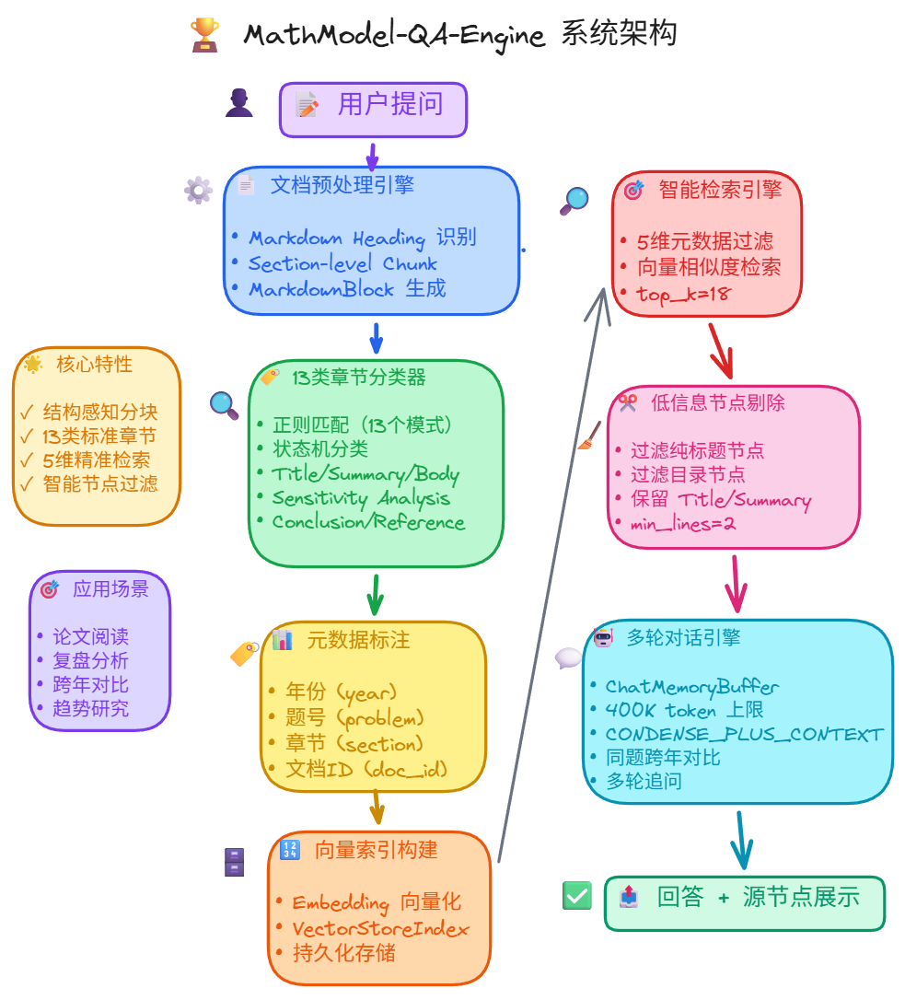

<div align="center">

# 📐 MathModel-QA-Engine

**数学建模竞赛论文 RAG 问答引擎**

基于 LlamaIndex 构建的检索增强生成（RAG）系统，专为分析 MCM/ICM （说不定还有国赛优化呢） 等数学建模竞赛历年获奖论文而设计。

[](https://www.python.org/)
[](https://www.llamaindex.ai/)
[](LICENSE)



</div>

---

## 💡 为什么做这个项目？

一切都启发于我在打美赛前准备阅读往年 O 奖论文时的苦痛，当时就联想到之前打别的比赛学习的 RAG 技术，当时的基础是 LangChain ，这次综合考虑选择了 LlamaIndex 。
数学建模竞赛论文，特别是美赛，有一个天然的特点：**结构高度统一**。几乎所有论文都遵循 Summary → Introduction → Assumptions → Body → Sensitivity Analysis → Conclusion 这样的章节结构。

但是大多数 RAG 系统采用固定 token 长度的 chunk 切分，这对于结构化论文来说并不理想——可能一段 Sensitivity Analysis 就被切到两个 chunk 里，同时混入上一节的尾巴和下一节的开头，导致检索时噪声很大。

**本项目的核心思路：按 Markdown 主标题（heading）进行分块，让每个节点天然对应论文中的一个章节。** 只有当某个标题下的内容过长时，才进一步细分。这样做的好处是：

- 🎯 **精准的章节级检索** — 想只看所有论文的 Summary？或者只研究 Sensitivity Analysis 的写法？一个参数即可做到
- 🧩 **语义完整** — 每个检索节点都是一个完整的章节段落，不会出现被截断的半句话
- 📊 **丰富的元数据** — 每个节点自带 `year / problem / section / doc_id` 等标签，支持多维度精准过滤

---

## ✨ 功能亮点

| | 特性 | 描述 |
|---|---|---|
| 💬 | **多轮对话** | 基于 ChatMemoryBuffer 的上下文记忆，对话越深越精准 |
| 🧩 | **结构化分块** | 按 heading 拆分 + 正则状态机自动识别 13 类章节 |
| 🎯 | **多维过滤** | 年份 / 题号 / 章节 / 文档 ID，任意组合限定检索范围 |
| 📈 | **跨年趋势分析** | 跨年份对同一题型（如历年 C 题）进行横向对比，考察 O 奖论文的方法演变与趋势 |
| 🧹 | **智能后处理** | 自动过滤纯标题节点和目录节点，降低检索噪声 |
| 🔌 | **API 兼容** | 支持 OpenAI / DeepSeek / 智谱 等任何 OpenAI 兼容接口 |

---

## 📁 项目结构

```
MathModel-QA-Engine/
├── rag_cli.py              # 主入口 (build 构建索引 / chat 交互问答)
├── mmqa/                   # 论文预处理工具包 (MathModel QA)
│   ├── __main__.py         # python -m mmqa split 分块命令
│   ├── markdown_blocks.py  # Markdown heading 解析器
│   ├── node_export.py      # 论文分块 + JSONL 导出
│   ├── papers_csv.py       # papers.csv 读取
│   ├── postprocessors.py   # 低质节点过滤器 (DropLowInfoNodes)
│   ├── sections.py         # 13 类章节分类器 (正则 + 状态机)
│   └── titles_csv.py       # 论文标题归一化
├── data/                   # 数据目录 (见下方说明)
│   ├── papers.csv          # 论文元数据
│   ├── problems.csv        # 赛题元数据
│   ├── papers_titles.csv   # 论文标题列表
│   ├── papers/             # 论文 Markdown 源文件
│   ├── problems/           # 赛题 Markdown 源文件
│   └── nodes/              # 预处理后的 JSONL 节点 (可重新生成)
├── storage/                # [自动生成] 向量索引
├── .env                    # [需自行创建] API 配置
├── requirements.txt
└── .gitignore
```

---

## 🚀 快速开始

### 1️⃣ 克隆仓库 & 安装依赖

```bash
git clone https://github.com/YOUR_USERNAME/MathModel-QA-Engine.git
cd MathModel-QA-Engine
```

**Conda（推荐）：**

```bash
conda create -n mcm python=3.12 -y
conda activate mcm
pip install -r requirements.txt
```

**venv：**

```bash
python -m venv .venv
source .venv/bin/activate   # Windows: .venv\Scripts\activate
pip install -r requirements.txt
```

### 2️⃣ 配置 API

在项目根目录创建 `.env` 文件：

```bash
# === 必填 ===
OPENAI_API_KEY="sk-your-key-here"

# 如使用第三方兼容接口 (中转站 / DeepSeek / 智谱等)，设置 Base URL：
OPENAI_API_BASE="https://api.openai.com/v1"

# === 可选 ===
OPENAI_MODEL="gpt-5.2"                   # LLM 模型 (默认 gpt-4o-mini)
OPENAI_EMBED_MODEL="text-embedding-3-large"   # Embedding 模型
CHAT_TOKEN_LIMIT="400000"                     # 对话记忆 token 上限
SIMILARITY_TOP_K="18"                         # 默认检索 Top-K 数
```

### 3️⃣ 构建向量索引

```bash
python rag_cli.py build --show-progress
```

> 首次构建需要几分钟（取决于 Embedding API 速度）。索引存储于 `storage/`，后续启动会自动加载。  
> 如需强制重建：`python rag_cli.py build --rebuild --show-progress`

### 4️⃣ 开始对话

```bash
python rag_cli.py chat
```

输入问题即可，输入 `quit` 退出。

---

## 🔧 进阶用法

本项目的核心优势在于**章节级精准检索**。通过过滤参数，你可以将知识库范围限定到特定年份、题号、章节类型，甚至某一篇论文：

```bash
# 只看 2025 年 C 题的所有论文
python rag_cli.py chat --year 2025 --problem C

# 只看 Summary 章节 —— 快速了解各论文的核心方法
python rag_cli.py chat --year 2025 --problem C --section "Summary"

# 只看 Sensitivity Analysis —— 研究灵敏度分析的写法
python rag_cli.py chat --section "Sensitivity Analysis"

# 跨年份对比同一题型 —— 考察 O 奖方法的演变趋势
python rag_cli.py chat --problem C --section "Body"

# 精确到某篇论文
python rag_cli.py chat --doc-id 2025C_1

# 增大检索量 + 显示来源（调试用）
python rag_cli.py chat --year 2025 --problem C --top-k 30 --show-sources 5
```

### 完整参数一览

| 参数 | 说明 | 示例 |
|---|---|---|
| `--year` | 按年份过滤 | `--year 2025` |
| `--problem` | 按题号过滤 (A–F) | `--problem C` |
| `--problem-id` | 按问题 ID 过滤 | `--problem-id 2025C` |
| `--section` | 按章节类型过滤 | `--section "Body"` |
| `--doc-id` | 按文档 ID 过滤 | `--doc-id 2025C_1` |
| `--top-k` | 检索数量（覆盖 .env 默认值） | `--top-k 20` |
| `--show-sources N` | 显示前 N 个检索来源 | `--show-sources 5` |
| `--keep-heading-only` | 保留纯标题节点（默认过滤） | |
| `--keep-toc` | 保留目录节点（默认过滤） | |

### 可用的章节类型

| 章节类型 | 对应内容 |
|---|---|
| `Title` | 论文标题 |
| `Summary` | 摘要 |
| `Contents` | 目录 |
| `Introduction` | 引言 / 背景 / 文献综述 |
| `Assumptions and Justifications` | 假设与合理性说明 |
| `Notations` | 符号表 |
| `Preparation` | 数据预处理 / 模型准备 |
| `Body` | 正文主体（建模、求解、算法等） |
| `Sensitivity Analysis` | 灵敏度 / 鲁棒性分析 |
| `Strengths and Weaknesses` | 优缺点分析 |
| `Conclusion` | 结论 |
| `Reference` | 参考文献 |
| `Others` | 其他（附录、AI 使用报告等） |

---

## 🏗️ 系统架构

```
论文 Markdown ──→ heading 分块 ──→ 章节分类 (13 类) ──→ JSONL 节点
                                                          │
                                                    Embedding 向量化
                                                          │
用户提问 ──→ 元数据过滤 ──→ 向量检索 ──→ 低质节点过滤 ──→ LLM 对话引擎 ──→ 回答
     ↑                                                          │
     └──────────── 多轮对话记忆 (ChatMemoryBuffer) ←────────────┘
```

1. **预处理** — 按 Markdown heading 拆分论文，正则 + 状态机自动归类为 13 种标准章节
2. **向量索引** — 通过 OpenAI Embedding API 将结构化节点向量化并建立索引
3. **检索过滤** — 根据 `year / problem / section` 等元数据构建 MetadataFilters 精准命中
4. **后处理** — `DropLowInfoNodesPostprocessor` 自动丢弃纯标题和目录噪声节点
5. **多轮对话** — `CONDENSE_PLUS_CONTEXT` 模式，支持带记忆的连续深入问答

---

## 🔄 数据预处理（可选）

如果你新增或修改了 `data/papers/` 中的论文，需要重新生成 JSONL 节点：

```bash
python -m mmqa split \
  --mode block \
  --out-jsonl data/nodes/nodes.block.jsonl \
  --out-text-nodes-jsonl data/nodes/text_nodes.block.jsonl

# 然后重建索引
python rag_cli.py build --rebuild --show-progress
```

---

## 📊 关于数据

> **⏳ 数据整理中** — 为了质量需要人工复核每篇论文的 Markdown 标题切分质量，以确保 heading 层级正确、章节分类准确，`data/` 目录暂未上传，因为我之前只精细筛选了 2025 的 C 题 O 奖论文。同时我最近比较忙，如果整理完成后会尽快发布，敬请期待！（希望我不会 🕊️ 太久

目前已收录：

| 年份 | 题目 | 论文数 |
|---|---|---|
| 2024 | A–F | 40+ 篇 |
| 2025 | A–F | 30+ 篇 |

如果你有自己的论文数据，可以参照 `data/papers.csv` 的格式自行准备，然后运行预处理流程。

---

## 🤝 贡献

欢迎各位数模人体验之后提交 Issue 和 Pull Request！

## 📄 许可证

[MIT License](LICENSE)
